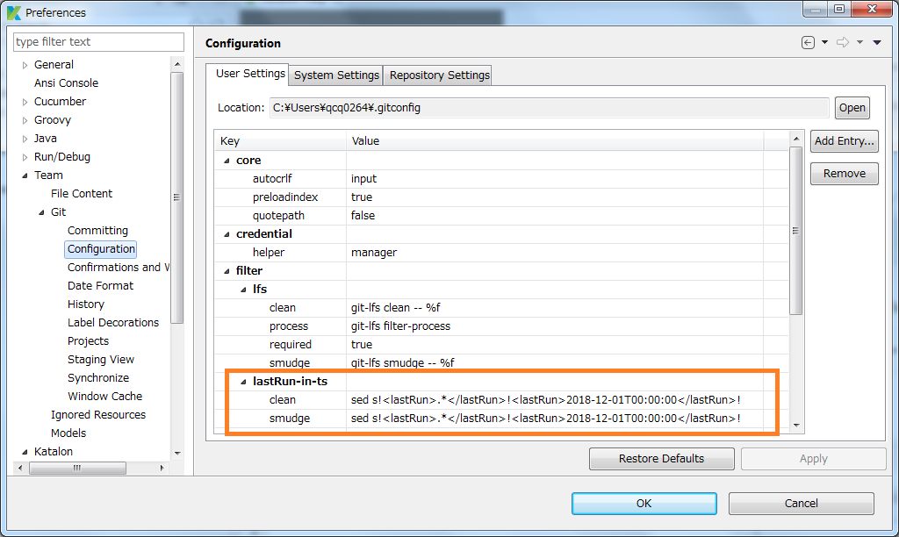
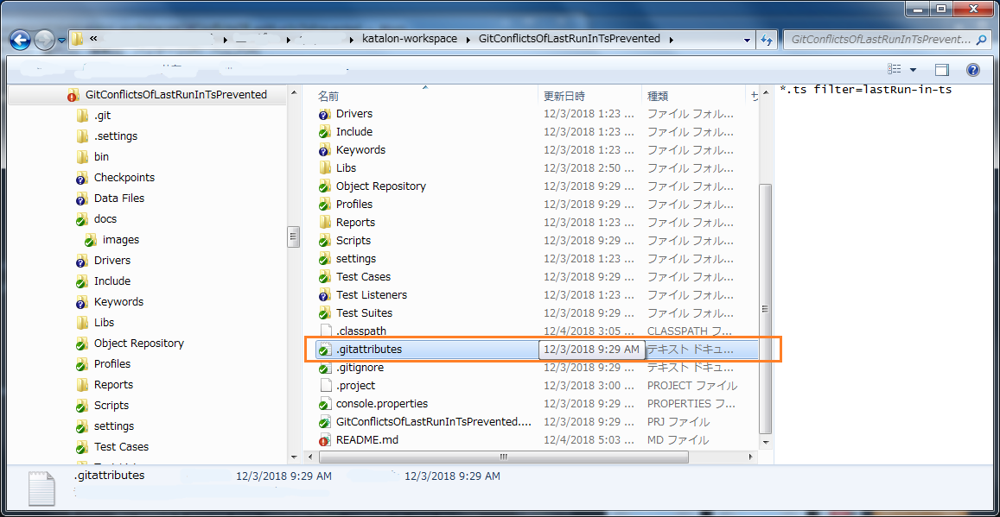

# How to prevent Git conflicts of `<lastRun>...</lastRun>` in `*.ts` files in Katalon Studio

by kazurayam 5,Dec 2018

## Problem to solve

When you create a Test Suite `Test Suite/TS1` in a Katalon Studio project, Katalon Stuido will make `<projectDir>/Test Suites/TS1.ts` file. The file will look like, for example, as follows:
```
<?xml version="1.0" encoding="UTF-8"?>
<TestSuiteEntity>
   <description></description>
   <name>TS1</name>
   <tag></tag>
   <isRerun>false</isRerun>
   <lastRun>2018-12-02T10:22:40</lastRun>
...
```

Please find a timestamp info as `<lastRun>` is included. This timestamp will be updated by Katalon Studio when you ran the `Test Suites/TS1`.

You have made the project version-controlled by Git. It's good idea. And you want to share the project with your team mates using a remote Git repository?

I would warn you. The changes of `lastRun` info made by yourself and by your team mates tend to conflict. This problem is small but itchy, and will make your team collaboration very hard.

### How Git conflict occurs in a Katalon Studio project --- a typical case

Following steps illustrates how a Git conflict for `<lastRun>` occurs.

1. Your team mate had pushed `<lastRun>2018-12-04T14:12:26</lastRun>` to `<projectDir>/Test Suites/TS1.ts` file in the `master` branch of the remote Git repository.
2. Unfortunately, you forgot to *pull* the remote repository.
3. Your remote-tracking branch `origin/master` has `<projectDir>/Test Suites/TS1.ts` file with old value of `<lastRun>2018-12-02T10:22:40</lastRun>`.
4. You opended Katalon Studio and executed `Test Suites/TS1`. Effectively `TS1.ts` file in the Working Directory was updated with new timestamp `2018-12-04T14:26:55`.
5. You successfully executed `$ git add .` and `$ git commit -m ".."`. Effectively you updated `<projectDir>/Test Suites/TS1.ts` file in the local `master` branch with new value `<lastRun>2018-12-04T14:26:55</lastRun>`.
6. Then you do `$ git push`. You will encounter a error saying as follows:.
```
To https://github.com/kazurayam/GitConflictsOfLastRunInTsReproduced.git
 ! [rejected]        master -> master (fetch first)
error: failed to push some refs to 'https://github.com/kazurayam/GitConflictsOfLastRunInTsReproduced.git'
hint: Updates were rejected because the remote contains work that you do
hint: not have locally. This is usually caused by another repository pushing
hint: to the same ref. You may want to first integrate the remote changes
hint: (e.g., 'git pull ...') before pushing again.
hint: See the 'Note about fast-forwards' in 'git push --help' for details.
```
7. You got a bit surprised but recognized you need to do  *git pull*. So you tried, but you got CONFLICT with the following message.
```
$ git pull
remote: Enumerating objects: 7, done.
remote: Counting objects: 100% (7/7), done.
remote: Compressing objects: 100% (2/2), done.
remote: Total 4 (delta 2), reused 4 (delta 2), pack-reused 0
Unpacking objects: 100% (4/4), done.
From https://github.com/kazurayam/GitConflictsOfLastRunInTsReproduced
   06c3863..6ad77e2  master     -> origin/master
Auto-merging Test Suites/TS1.ts
CONFLICT (content): Merge conflict in Test Suites/TS1.ts
Automatic merge failed; fix conflicts and then commit the result.
```
8. You looked at the content of TS1.ts file. You found a marke-up for conflict as follows:
```
$ cat "Test Suites/TS1.ts"
<?xml version="1.0" encoding="UTF-8"?>
<TestSuiteEntity>
   <description></description>
   <name>TS1</name>
   <tag></tag>
   <isRerun>false</isRerun>
<<<<<<< HEAD
   <lastRun>2018-12-04T14:26:55</lastRun>
=======
   <lastRun>2018-12-04T14:12:26</lastRun>
>>>>>>> 6ad77e2a58ebbebd19f16c15f3e202942ada58bf
   <mailRecipient></mailRecipient>
...
```
9. So messy. You are lost. You do not know what to do next.

>I have made another Katalon Studio project and published it on GitHub in order to trace the above operation and results:
>- https://github.com/kazurayam/GitConflictsOfLastRunInTsReproduced


## Solution proposed

The `<proejectDir>/Test Suites/TS1.ts` file is very important for a Katalon Studio project. It is the definition of a Test Suite `TS1`. You can not *gitignore* it. You should save it in the Git repository.

However the `<lastRun>...</lastRun>` line in the `TS1.ts` file looks  NOT significant. Whatever timestamp is saved in Git repository, possibly it does not matter. You can let Katalon Studio to overrite `<lastRun>` info in `TS1.ts` file the working directory as it wants to.

>I have no idea how the lastRun info is used by Katalon Studio. Is it really necessary? --- I doubt it.

The idea is as follows:

1. we will intentionally keep the lastRun info in \*.ts files to be a Magical Timestamp *2018-12-01T00:00:00* anywhere in the Git repository for the Katalon Project. Here by saying *Anywhere* I means either of local and remote repository, all of branches, either of local branch: "master", staging area and remote-tracking branch: "origin/master".  
2. The \*.ts files in Working Directory will be updated by Katalon Studio when you run a Test Suite. OK. Let it go as designed.
3. When you do "git add Test\ Suite/TS1.ts", *clean* filter reads the file in the Working Directory, rewrite it to have `<lastRun>2018-12-01T00:00:00<lastRun>`, and stage it.
4. When you do "git clone <remote git repository url>", *smudge* filter reads the file in the local branch, rewrite it to have `<lastRun>2018-12-01T00:00:00<lastRun>`, and locate the result in the Working Directory.

The following figure explains what *filter* does.


## How to implement the solution

We will employ 2 Git features.
1. filter
2. `.gitattributes` file

>Reference
>- [Pro Git, 8.2 Customizing Git - Git Attributes](https://git-scm.com/book/en/v2/Customizing-Git-Git-Attributes)

### Step1 Choose filter tool of your choice : sed

Git filter requires one-liner script to filter a file. Here I choose good old [`sed`](http://gnuwin32.sourceforge.net/packages/sed.htm) command. `sed` is built-in on Mac OSX and linux. But if you work on Windows then you need to install *sed for Windows*. I will guide how to later.

`sed` is not the only one to implement Git filter. [git-scm.com](https://git-scm.com/book/en/v2/Customizing-Git-Git-Attributes) shows a filter by Ruby. [Other page](https://www.jimhester.com/2017/11/01/git_clean_smudge/) uses Perl. Which ever command is OK as far as it works as a test filter.

### Step2 Define Git filters

We will define a pair of Git filter
1. `lastRun-in-ts.clean`
2. `lastRun-in-ts.smudge`

In order to do it, you want to edit the `.gitconfig` of your OS user, which is located at
- `%USERPROFILE%\.gitconfig` in Windows
- `~/.gitconfig` in Mac OSX and Linux

You can use any text editor of your choice.

You want to instert following lines:
```
[filter "lastRun-in-ts"]
        smudge = sed "s!<lastRun>.*</lastRun>!<lastRun>2018-12-01T00:00:00</lastRun>!"
        clean = sed "s!<lastRun>.*</lastRun>!<lastRun>2018-12-01T00:00:00</lastRun>!"
```

You can check the editting result in Katalon Forum as well. Open Katalon Studio and click `Window > Katalon Studio Preferences`. In the dialog, select `Team > Git > Configure`. In the  


All of your team members and CI servers who will execute the Katalon Studio project are required to edit the `~/.gitconfig` file as described here.

### Step3 Add `.gitattributes` file to the project

The `filter.lastRun-in-ts.clean` and `filter.lastRun-in-ts.smudge` defined in the `~/.gitconfig` file has global scope to all of Git repository of the user. However you have option if you want to make those filters effective to each indivisual Git repositories (= Katalon Studio projects).

In order to make those filters effective, you want to add  `.gitattributes` file into the project directory:
```
*.ts filter=lastRun-in-ts
```


You should add `.gitattributes` file into the repository and let it shared by all of your team members.

## Installing `sed for Windows`

The method I present here requires `sed` command on your machine operational in the command line. MacOS and Linux has `sed` built-in. But Windows does not have it.

The following steps show you how to install `sed for Windows` into your Windows PC.

1. You can download the Setup program for `sed for Windows` from [here](http://gnuwin32.sourceforge.net/packages/sed.htm).
2. Find "Download > Complate package, except sources Setup" and click the [link](http://sourceforge.net/projects/gnuwin32/files//sed/4.2.1/sed-4.2.1-setup.exe/download). The Setup program will be downloaded.
3. Execute the downloaded `sed-4.2.1-setup.exe`. The installer will install the `sed` command.
4. Confirm that the `sed` is operational in the command line. Open the command prompt window, and type:

```
C:\Users\kazurayam>sed --version
```
`sed` command will respond :
```
GNU sed 4.2.1

Copyright (C) 2009 Free Software Foundation, Inc.
This is free software; see the source for copying conditions.  There is NO
warranty; not even for MERCHANTABILITY or FITNESS FOR A PARTICULAR PURPOSE,
to the extent permitted by law.

GNU sed home page: <http://www.gnu.org/software/sed/>.
General help using GNU software: <http://www.gnu.org/gethelp/>.
E-mail bug reports to: <bug-gnu-utils@gnu.org>.
Be sure to include the word 'sed' somewhere in the 'Subject:' field.
```

If you see garbled characters in the Command prompt, you need to change the code page to be UTF-8:
```
C:\Users\kazurayam>chcp 65001
```


## Related discussions

In the Katalon Studio Forum, there are a few discussions related to the `lastRun` conflicts.

1. [Git: master->master \[rejected - non-fast-forward\]](https://forum.katalon.com/discussion/11284/git-master-master-rejected-non-fast-forward) by Mate Mrse at 11/30/2018
2. [\[Suggestion\]\[Katalon Studio\] Last Run info could be saved in a serarate file \(in the .ts file\)](https://forum.katalon.com/discussion/7146/suggestion-katalon-studio-last-run-info-could-be-saved-in-a-separate-fille-not-in-the-ts-file) by Lauro Araujo at 05/31/2018
3. [Every time I run test suite it will be updated then I have a new git commit](https://forum.katalon.com/discussion/9587/every-time-i-run-test-suite--it--will-be-updated-then-i-have-a-new-git-commit) by qiulang at 09/11/2018
4. [Commits from different machines cause conflicts in Git](https://forum.katalon.com/discussion/4881/commits-from-different-machines-cause-conflicts-in-git) by Alex Brohin at 08/04/2017

Please note one thing.
At 08/10/2017 (16 months ago), Oliver Howard posted a comment https://forum.katalon.com/discussion/comment/10492/#Comment_10492 where he presented a solution to `lastRun` conflicts. He explained how to configure Git with filter and .gitattribute file. Thanks to Oliver, but this comment seems to be unknown by Katalon users. I am going to explain just the same know-how again in a more verbose way so that it is shared by more of Katalon Studio uses working with Git.
